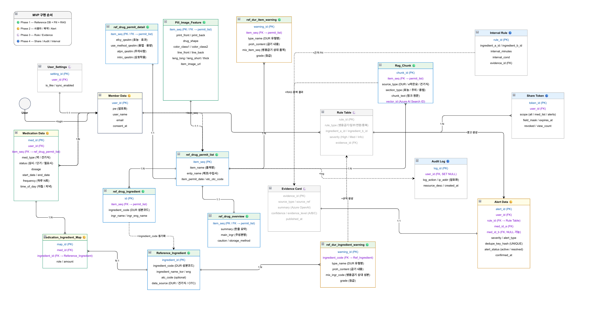

# 02. 시스템 아키텍처

## 전체 구성도

```
[사용자 — React + Vite]
        │
        ▼
[FastAPI 서버 — pill-ai-kr VM]
  ├── /drug/search     (약 이름 검색)
  ├── /drug/suggest    (퍼지 검색)
  ├── /drug/ask        (RAG 질의응답)
  ├── /drug/dur        (DUR 병용금기)
  └── /drug/check      (병용금기 체크)
        │
        ├──────────────────────────────────┐
        ▼                                  ▼
[Oracle DB — oracle-db-kr VM]   [Azure AI Search]
  REF_DRUG_PERMIT_LIST            pill-rag-index
  REF_DRUG_PERMIT_DETAIL          (266,306건 벡터 인덱싱)
  REF_DUR_ITEM_WARNING                    │
  PILL_IMAGE_FEATURE                      ▼
  RAG_CHUNK                      [Azure OpenAI GPT-4o-mini]
        │                          RAG 기반 답변 생성
        ▼
[이미지 파이프라인 — pillv2 VM]
  YOLOv8 Object Detection
  Azure OCR (Document Intelligence)
  ResNet 분류 모델
```

---

## Azure 인프라 구성

| VM 이름 | 역할 | 리전 |
|---|---|---|
| pill-ai-kr | FastAPI 백엔드 API 서버 | Korea Central |
| oracle-db-kr | Oracle XE 21c DB 서버 | Korea Central → East US 2 (스냅샷 이전) |
| pillv2 | 이미지 데이터 처리 서버 (3.65TB 디스크) | Korea Central |

### 멀티 리전 이전 배경 (Korea Central → East US 2)

Korea Central 리전 VM은 물리적 위치는 한국이지만 실질적 네트워크 상 `Country: US / Microsoft Corporation`으로 인식되어, AI Hub 데이터 다운로드 시 해외 IP 차단 문제가 발생했습니다. 이를 해결하기 위해 학원 노트북을 프록시 서버로 활용하고, 이후 일부 서비스는 East US 2 리전으로 이전했습니다.

---

## Azure 서비스 구성

| 서비스 | 용도 |
|---|---|
| Azure VM (Standard) | API 서버·DB 서버·데이터 처리 서버 |
| Azure Blob Storage | 3.4TB 이미지 데이터 백업 및 H100 학습 연동 |
| Azure AI Search | RAG용 벡터 인덱싱 및 퍼지 검색 |
| Azure OpenAI (GPT-4o-mini) | RAG 기반 자연어 답변 생성 |
| Azure AI Document Intelligence | OCR — 알약 각인 문자 추출 |
| Azure Managed Disk (Premium SSD) | 대용량 이미지 데이터 저장 |

### Storage 전략
- **작업 공간**: Azure VM에 Managed Disk(10TB) 직접 마운트하여 데이터 처리
- **백업**: 처리 완료 후 Azure Blob Storage (Cool Tier)에 최종 결과물 백업
- **이유**: Blob Storage 직접 마운트(blobfuse2) 방식은 대용량 파일 쓰기 시 연결 불안정 문제가 있어 Managed Disk 우선 사용

---

## DB 설계 (v7)



전체 설계는 4단계 MVP 구현 순서를 기준으로 작성했습니다.

| Phase | 범위 | 구현 여부 |
|---|---|---|
| Phase 1 | Reference DB + Pill + RAG | ✅ 완료 |
| Phase 2 | 사용자 / 복약 / Alert | 설계 완료, 미구현 |
| Phase 3 | Rule / Evidence | 설계 완료, 미구현 |
| Phase 4 | Share / Audit / Interval | 설계 완료, 미구현 |

Phase 1 핵심 테이블 9종을 완성하고 56만건 적재까지 마쳤으며, Phase 2 이후는 서비스 확장 시 구현 예정으로 ERD까지 설계해두었습니다.

---

## 데이터 흐름

```
[식약처 공공데이터 API]
        │ Python requests + JSON 파싱
        ▼
[CSV → JSON → Parquet 변환]
        │ pandas 정제·정규화
        ▼
[정제된 Parquet 파일들]
   ├── dur_item_*_clean.parquet        (DUR 품목 경고)
   ├── dur_ingredient_*_clean.parquet  (DUR 성분 경고)
   ├── drugPrmsnInfo_*_clean.parquet   (허가정보)
   └── 낱알식별정보.parquet
        │
        ├── load_parquet_to_oracle.py → OracleDB 적재
        │
        └── index_rag_chunks.py → Azure AI Search 인덱싱
```

---

## 검색 아키텍처 — 하이브리드 검색

Azure AI Search를 통해 키워드 검색과 벡터 검색을 결합한 하이브리드 검색을 구현했습니다.

- **퍼지 검색**: 오타나 유사 약품명 입력 시 물결표(`~`) 기반 유사도 검색
- **벡터 검색**: 사용자 자연어 질문을 임베딩으로 변환해 의미 기반 유사 청크 검색
- **인덱스**: `pill-rag-index` (266,306건, section_type 기준 청킹)

---

## 실제 구현 — E2E 파이프라인 코드

```python
def run_pipeline(image_path: str):
    topk = predict_topk(image_path, k=5)       # YOLOv8 → Top-5 후보
    ocr_result = run_ocr(image_path)            # Azure OCR → 각인 추출
    drug_info = query_drug(topk, ocr_result)    # Oracle DB → 후보 재정렬
    rag_text = generate_explanation(drug_info)  # RAG → 자연어 설명 생성
    return {"topk": topk, "ocr": ocr_result, "drug_info": drug_info, "rag_text": rag_text}
```

4줄로 전체 파이프라인이 연결됩니다. 각 단계가 독립 모듈로 분리되어 있어 교체·테스트가 용이합니다.

---

## 실제 구현 — Azure OCR

```python
def run_ocr(image_path: str):
    variants = generate_ocr_variants(image_path)  # 전처리 변형본 생성
    for variant_name, variant_img in variants:
        poller = client.begin_analyze_document(
            "prebuilt-read",           # Azure Document Intelligence Read API
            analyze_request=f,
            content_type="application/octet-stream"
        )
        for word in result.pages[0].words:
            ocr_raw.append(word.content.strip())
            ocr_norm.append(normalize_imprint(raw))  # 각인 정규화

    return {
        "ocr_raw": list(dict.fromkeys(ocr_raw)),   # 중복 제거
        "ocr_norm": list(dict.fromkeys(ocr_norm))
    }
```

여러 전처리 변형본(`generate_ocr_variants`)을 만들어 OCR을 반복 시도하고, 결과를 정규화(`normalize_imprint`)해서 중복 없이 반환합니다.
